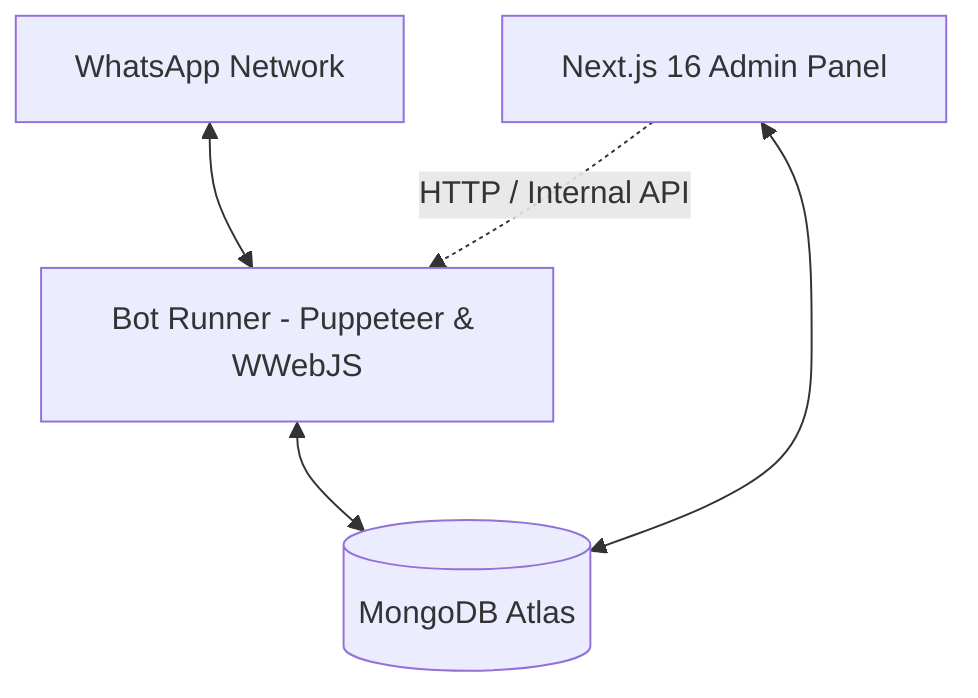

# Root Architecture

## Visión General del Sistema (OdontoBot / Dental-Response)

El sistema es una solución omnicanal para consultorios odontológicos compuesta por dos módulos principales interconectados mediante MongoDB Atlas:

### Componentes

1. **`bot-runner/` (Motor de WhatsApp & Máquina de Estados)**:
   - Node.js + `whatsapp-web.js` corriendo sobre Chromium/Puppeteer.
   - Maneja el ciclo de vida de mensajes entrantes (`message`, `message_create`), llamadas y presencia.
   - Máquina de estados jerárquica guiada por el documento `Flow` activo.
   - **Invariante de Pausa Estricta (D-08)**: chats en `state: 'paused'` permanecen silenciados ante cualquier interacción (texto, audio, imagen, documentos). No existen auto-despausas automáticas.
   - **Preservación de No Leídos (D-09)**: no invoca `openChatAt` en chats derivados; marca `chat.markUnread()` y sincroniza la etiqueta `Derivado con Personal` de WhatsApp.

2. **`src/` (CRM & Panel Administrativo Next.js 16)**:
   - Next.js 16 App Router con Turbopack y Tailwind CSS.
   - `/admin/conversations`: Gestión de chats, filtrado por "No Leídos", destacador visual de chats prioritarios, botón manual de alternar leído/no leído.
   - `/admin/leads`: Gestión y kanban de leads con estados y tags.
   - `/admin/flows`: Editor visual de flujos conversacionales.
   - `/api/*`: Endpoints REST para manipular conversaciones, contactos, flujos y comunicarse con el bot runner.

3. **Base de Datos (MongoDB Atlas)**:
   - Colección `conversations`: Estado de la sesión (`state`), paso actual (`currentStepId`), historial de mensajes, banderas de lectura (`hasUnread`, `unreadCount`), timestamps y etiquetas.
   - Colección `contacts`: Registro único de contactos, nombres, teléfonos sanitizados, estado de agenda y contadores de no leídos.
   - Colección `flows`: Definición de pasos, transiciones, etiquetas y mensajes del bot.
