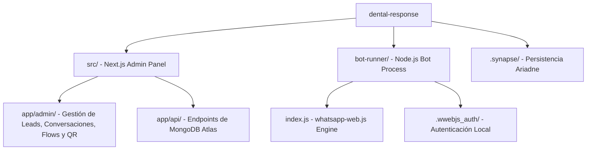

# 📑 Historial de Conversaciones de Antigravity - Proyecto OdontoBot

Este archivo registra el análisis de la estructura del proyecto `dental-response` y los resultados de la búsqueda de la conversación original en el motor de persistencia de **Antigravity**.

---

## 🔍 Conversación Original Encontrada

Tras escanear el directorio local de persistencia de Antigravity (`C:\Users\Try Hard\.gemini\antigravity\brain` y `conversations`), se localizó la sesión principal de desarrollo correspondiente a este bot:

### 1️⃣ Conversación Principal de Desarrollo: `d1e0edf7-ee1c-430b-8d96-3271cffddba3` ("WhatsApp Unread Labels")
*   **Fecha de Inicio:** 16 de Enero de 2026.
*   **Fecha de Última Modificación:** 4 de Abril de 2026.
*   **Propósito:** Es la conversación base donde se desarrolló e iteró todo el sistema de **OdontoBot / dental-response**. Contiene **251 archivos de diseño** (walkthroughs e implementation plans de cada iteración).
*   **Hitos de esta Conversación:**
    *   *Conexión del Frontend a APIs Reales (V11):* Dashboard, Leads, Conversaciones y Flows (lista + crear) conectados a MongoDB.
    *   *Resolución de Loops de Escritura:* Solución al bug de "Typing state loop" en `whatsapp-web.js` y persistencia de estados de Mongoose.
    *   *Horarios de Atención:* Respuestas automáticas para mensajes fuera del horario de la clínica.
    *   *Calificación de Leads R.A.D. y Precios Duales:* Embudo segmentado para pacientes vs profesionales, y opciones de pago de "Informe Online" vs "Consulta Presencial".
    *   *Sincronización de Etiquetas de WhatsApp Business:* Automatización para etiquetar estados comerciales en WhatsApp.
*   **Respaldo Local:** Se han copiado todos los documentos históricos de esta conversación a:
    `C:\Users\Try Hard\.gemini\antigravity\scratch\dental_walkthroughs\` (planes de implementación, checklists de tareas y walkthroughs detallados).

---

## 🛠️ Estructura del Codebase `dental-response`

El análisis de la carpeta raíz del proyecto muestra una arquitectura de dos componentes principales diseñados para ejecutarse en entornos Docker paralelos:



### Componentes Clave en `bot-runner/index.js`:
1.  **Llamadas Entrantes (`client.on('call')`):** 
    *   Si es un contacto guardado (`isMyContact`), lo deja sonar libremente.
    *   Si no está agendado, corta/rechaza la llamada automáticamente e inicia el flujo del bot en la conversación, enviando un mensaje informativo de bienvenida.
2.  **Prevención Multi-Instancia:**
    *   Genera un `INSTANCE_ID` aleatorio.
    *   Implementa un bloqueo atómico por número de teléfono en MongoDB (`Setting.create({ key: lockKey, instance: INSTANCE_ID })`) con cooldown de 60 segundos para evitar que varias instancias procesen el mismo mensaje en paralelo.
3.  **Filtrado de Mensajes del Sistema (`msg.type`):**
    *   Ignora notificaciones del sistema de WhatsApp (como cambios de número o códigos de seguridad) procesando solo tipos válidos (`chat`, `image`, `ptt`, `audio`, etc.).
4.  **Marcado Persistente como No Leído (`markUnread`):**
    *   Si la conversación tiene activo el flag `forceUnread`, re-marca el chat como no leído en WhatsApp con un delay de 3 segundos después de enviar un mensaje saliente, garantizando que el operador humano en el CRM vea el chat con el globito verde.

---

## 🖥️ Modificación de Datos y Despliegue en el VPS

A partir del análisis de la conversación **"WhatsApp Unread Labels"** y sus archivos históricos asociados, se consolidó el siguiente procedimiento para modificar variables, credenciales y flujos en el servidor de producción:

### 1. Conexión y Acceso al Servidor
*   Conéctate por SSH:
    ```bash
    ssh root@IP_DEL_VPS
    ```
*   El directorio de instalación suele ser `/root/odontobot` o `/root/dental-response` (o en el home del usuario correspondiente). Navega al directorio:
    ```bash
    cd odontobot
    ```

### 2. Modificación de Variables de Entorno (`.env`)
Para cambiar credenciales de administrador, la URI de la base de datos MongoDB Atlas o claves JWT, edita el archivo `.env` en el directorio raíz:
```bash
nano .env
```
Campos principales configurables:
*   `MONGODB_URI`: Cadena de conexión a MongoDB Atlas.
*   `JWT_SECRET`: Hash/frase secreta para firma de tokens.
*   `ADMIN_EMAIL` y `ADMIN_PASSWORD`: Credenciales de acceso para el CRM.
*   `WHATSAPP_SESSION_PATH`: Ruta interna del contenedor para la sesión (`/app/bot-runner/.wwebjs_auth`).
*   `NODE_ENV`: `production`

*(Guarda con `Ctrl+O`, confirma con `Enter` y sal con `Ctrl+X`)*.

### 3. Aplicar Cambios en los Servicios (Docker Compose)
Si modificaste el archivo `.env` o si hiciste cambios en el código y descargaste la última versión de Git (`git pull`), ejecuta el script de despliegue seguro para regenerar y reiniciar los contenedores:
```bash
# Otorgar permisos y ejecutar el script automatizado
chmod +x deploy-vps.sh
./deploy-vps.sh
```
*Alternativamente, puedes hacerlo de manera manual:*
```bash
git pull
docker-compose down
docker-compose up -d --build
```

### 4. Modificar Datos de Base de Datos y Flujos (Seeding)
Para inyectar o actualizar datos de configuración directamente en MongoDB Atlas:
*   **Crear/Actualizar credenciales de Admin CRM:**
    ```bash
    docker-compose exec nextjs node scripts/seed-admin.js
    ```
*   **Actualizar o Reiniciar el Flujo de la Conversación (Flow Builder / Salvador):**
    Si necesitas cargar el flujo principal con las reglas actualizadas de atención y handoff (por ejemplo, versión V113):
    ```bash
    docker-compose exec nextjs node nuclear_fix_salvador.js
    ```
    *Nota: Este script elimina flujos previos con nombre "Prueba Salvador", limpia el historial del número VIP de test y carga el nuevo esquema de pasos directamente en la base de datos.*

### 5. Comandos de Inspección y Diagnóstico
*   Ver logs del bot en vivo: `docker-compose logs -f bot-runner`
*   Ver logs de la aplicación Next.js: `docker-compose logs -f nextjs`
*   Ver uso de recursos (RAM/CPU): `docker stats`
*   Reiniciar un servicio específico: `docker-compose restart bot-runner`

---

## 🛠️ Corrección de Búsqueda de Leads y Mapeo LID (09/06/2026)

Se solucionó el problema crítico reportado por el cliente por el cual los leads se registraban con identificadores LID aleatorios (ej: `167954796826725`) en lugar de sus números reales, rompiendo la búsqueda en el CRM.

### Implementación Final en `bot-runner/index.js` (09/06/2026):
1.  **Helper `resolveLidToPhone`**:
    *   **Paso 1 (enforceLidAndPnRetrieval)**: Utiliza `window.WWebJS.enforceLidAndPnRetrieval` que llama internamente a `window.Store.QueryExist(wid)` en el navegador, consultando a los servidores de WhatsApp para mapear y traer el número telefónico real del usuario, incluso si no está guardado o en la caché local.
    *   **Paso 2 (LidUtils)**: Busca en la caché local del navegador evaluando `window.Store.LidUtils.getPhoneNumber(wid)`.
    *   **Paso 3 (getContactLidAndPhone)**: Si el método de la biblioteca está disponible, lo usa de respaldo.
    *   **Paso 4 (getContactById)**: Si el objeto de contacto ya posee la propiedad deserializada de número telefónico limpio, la retorna.
2.  **Listeners Modificados**:
    *   `call`: Resuelve el número de llamada para llamadas no agendadas.
    *   `message_create`: Normaliza el identificador de los logs de mensajes que van a la base de datos.
    *   `message`: Procesa el número limpio antes de los locks de concurrencia y de interactuar con el Flow Builder.
3.  **Rutina de Migración (`runLidMigration`)**:
    *   Se ejecuta asíncronamente cuando el bot se conecta (`client.on('ready')`).
    *   Filtra contactos con IDs de longitud >= 14 o terminados en `@lid` (excluyendo newsletters).
    *   Resuelve el teléfono real a través de los cuatro métodos anteriores (consultando el servidor de WhatsApp de ser necesario) y actualiza los registros en base de datos.
    *   **Fusión de Duplicados**: Si ya existe una ficha con el número de teléfono limpio, fusiona etiquetas, eventos e historiales, y elimina el registro huérfano de LID.
    *   Actualiza en cascada las colecciones de `Contact`, `Conversation` y `Message`.


